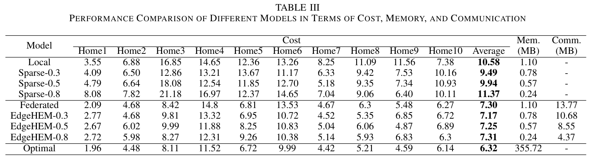
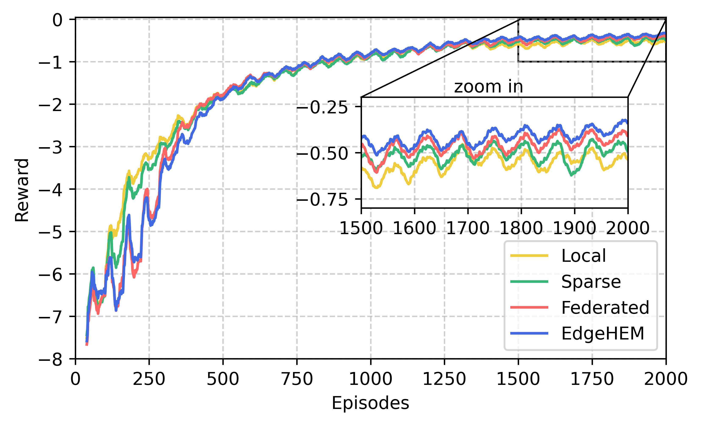

# Edge-Home-Energy-Management

Code for Paper “EdgeHEM: Sparse Federated Reinforcement Learning for Home Energy Management at the Edge”

## Overview

With the growth of energy demand and the popularization of distributed energy resources, home energy management (HEM) has been emerging as a crucial technology for improving energy efficiency and reducing electricity costs. HEM systems at the edge can provide more efficient and personalized energy services for households through real-time intelligent analysis. This paper proposes EdgeHEM, an edge reinforcement learning framework for HEM that considers the memory constraints of edge devices. Specifically, a dynamic sparse learning strategy with topology evolution is explored to overcome the memory limitations on the network scale. Furthermore, a compressed federated learning approach with gradient approximation is developed to leverage the transitions cached in the memory of multiple edge devices.

## Dataset

The current version supports the following datasets in New York region and tasks are saved in `dataset`:

```bash
- Pecan Street: residential load consumption and PV generation for individual homes
- NYISO: real-time electricity price of the competitve electrc marketplace
- Dark Sky: temperature data derived from various sources
```

## Test
You can evaluate this code with Python 3.10+ and PyTorch 1.4.0+.

To use the provided code, please run `test.ipynb` to obtain the results of the proposed method and benchmark methods.

> **Note:** Please select model hyperparameters to be tested before use.

## Experimental results

Enable resource-constrained edge devices to execute effective HEM ！

### Performance evaluation



### Convergence comparison



### Established testbed

